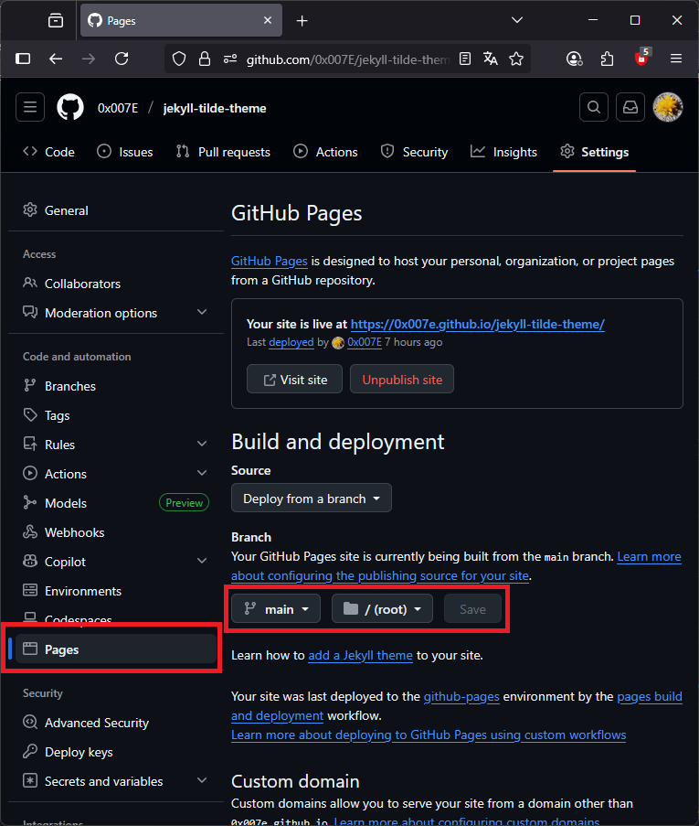

[](https://github.com/0x007e/jekyll-tilde-theme) [](./LICENSE.md) [](https://jekyllrb.com/) 

# Jekyll Tilde Template

This theme is designed to be used as a (multi-category) blog that gets automatically built with github-pages.

> An introduction of the functionallity, how to use this theme and a preview of it´s looking can be found [here](https://0x007e.github.io/jekyll-tilde-theme).

## Usings within this Template

The template is designed using `bootstrap` and `tabler` icons.

| Framework        | Version  |
|:-----------------|:--------:|
| **Bootstrap**    | `5.3.7`  |
| **Tabler Icons** | `latest` |

# Quickstart guide

To use this theme within your own repository on `github` simply create a repository from this template (details can be found [here](https://docs.github.com/en/repositories/creating-and-managing-repositories/creating-a-repository-from-a-template)) or clone it locally.

```bash
git clone https://github.com/0x007E/jekyll-tilde-theme.git
```

Then change the `_config.yml` according to your requirements and if necessary set the correct `url` and `baseurl`.

```yaml
url: "https://0x007e.github.io"
baseurl: "/jekyll-tilde-theme"
```

> If the template is used as your main page (e.g. `username.github.io`) leave the baseurl empty!

## Necessary Github settings

To enable `github-pages` within your repository it is necessary to activate them in the repository settings:



> If the theme should appear within a code repository just create a new branch (e.g. called github-pages) and put the files in there. It is necessary to choose the right `branch` in the `settings`.

## Run this template locally

After cloning the `jekyll-tilde-template` it is possible to run it locally on your linux machine or within wsl before pushing it to github.

### Install Ruby Gems

The following commands should be executed in the console.

```bash
echo '# Install Ruby Gems to ~/gems' >> ~/.bashrc
echo 'export GEM_HOME="$HOME/gems"' >> ~/.bashrc
echo 'export PATH="$HOME/gems/bin:$PATH"' >> ~/.bashrc
source ~/.bashrc
sudo apt update && sudo apt upgrade
sudo apt-get install ruby-full build-essential zlib1g-dev
gem install jekyll bundler
```

Rename the `jekyll-tilde-template` to a suitable name (e.g. `my-blog`) and switch into that folder an run `bundler install`.

```bash
bundler install
```

Bundler now installs the necessary packages and will only be needed in the future if the Gemfile is adjusted.

> Important Note: GitHub Pages only supports a specific set of gem packages with specific version numbers. If you're working with the latest version of Jeykll, you'll need to create your own action script and perform the build on your own. A list of the versions used in GitHub Pages can be found [here](https://pages.github.com/versions/).

If everything is installed correctly the created blog can be served locally with `bundle exec`.

```bash
bundle exec jekyll serve
```

You should now be able to open the blog at [http://localhost:4000](http://localhost:4000).

---

R. GAECHTER